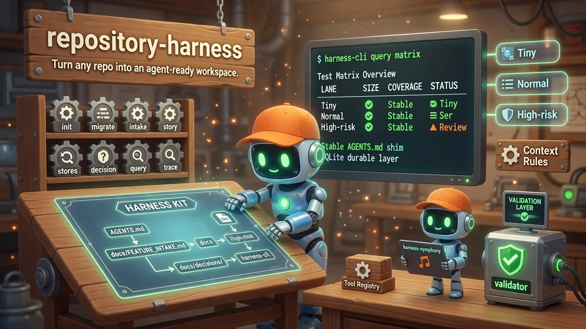

# repository-harness

<div align="center">
  
</div>

<div align="center">


</div>

**Turn any software repo into an agent-ready workspace.**  
Coding agents do not only need better prompts — they need better repositories. Harness installs the missing project context: where to start, product contract, risk lane, proof requirements, and decisions future agents should inherit.

<div align="center">

```bash
curl -fsSL "https://raw.githubusercontent.com/quangdang46/repository-harness/main/install.sh?$(date +%s)" \
  | bash -s -- --easy-mode --verify
```

</div>

---

## 🤖 Agent Quickstart

```bash
# After project install, query the harness
scripts/bin/harness-cli query matrix
scripts/bin/harness-cli query tools --capability deploy-verification --status present

# Record intake + story
scripts/bin/harness-cli intake --type "change-request" --summary "Add health endpoint" --lane tiny
scripts/bin/harness-cli story add --id US-001 --title "Health check endpoint" --lane tiny

# Run Symphony story
harness-symphony run <story-id> --prepare-only
```

**Output conventions**
- stdout = structured data
- stderr = diagnostics
- exit 0 = success

---

## TL;DR

### The Problem

Most repos are built for humans. Agents enter with a chat prompt and a shallow file snapshot:

| Failure mode | What happens |
|--------------|--------------|
| No product intent | Agent edits before understanding the contract |
| Chat-only constraints | Rules die when the session ends |
| Vague proof | Validation discovered too late |
| Repeated tradeoffs | Architecture decisions never get inherited |
| Monolith prompts | Large requests never become reviewable stories |

### The Solution

**repository-harness** installs a reusable operating layer that agents and humans share:

| Piece | Role |
|-------|------|
| `AGENTS.md` | Stable agent shim + Harness doc links |
| `docs/FEATURE_INTAKE.md` | Tiny / normal / high-risk classification |
| `docs/HARNESS.md` | Human–agent collaboration model |
| `docs/stories/` | Story packets and backlog |
| `docs/decisions/` | Durable tradeoffs |
| `harness-cli` | Query matrix, tools, stories, decisions |
| `harness-symphony` | Isolated story runner with reviewable changesets |

### Why Use Harness?

| Feature | What it does |
|---------|--------------|
| **Repo-durable context** | Intake, proof, and decisions survive chat history |
| **Risk lanes** | Tiny / normal / high-risk routing before code changes |
| **Story packets** | Reviewable units of work with validation expectations |
| **Decision log** | Future agents inherit tradeoffs instead of rediscovering them |
| **Tool registry** | Optional capabilities skip cleanly when absent |
| **Symphony runner** | Isolated workspaces + `SUMMARY.md` / `RESULT.json` |

---

### Quick Example

```bash
# Install binaries
curl -fsSL "https://raw.githubusercontent.com/quangdang46/repository-harness/main/install.sh?$(date +%s)" \
  | bash -s -- --easy-mode --verify

# Install harness docs into a project
cd ~/my-project
curl -fsSL "https://raw.githubusercontent.com/quangdang46/repository-harness/main/scripts/install-harness.sh?$(date +%s)" \
  | bash -s -- --yes --claude

# Query the test matrix and available tools
scripts/bin/harness-cli query matrix
scripts/bin/harness-cli query tools --capability deploy-verification --status present

# Record intake + a story
scripts/bin/harness-cli intake \
  --type "change-request" \
  --summary "Add health check endpoint" \
  --lane tiny
scripts/bin/harness-cli story add \
  --id US-001 \
  --title "Health check endpoint" \
  --lane tiny
```

---

## Design Philosophy

1. **The app is for users. The harness is for agents.**  
   Product code and agent operating surface are separate. Do not bury agent contracts inside product READMEs alone.

2. **Session-local prompts are not enough.**  
   Rules that only live in chat evaporate. Intake rows, stories, decisions, and proof status must be durable.

3. **Classify risk before writing code.**  
   Tiny work patches directly. Normal work gets a story. High-risk work gets a folder of design + validation docs and human confirmation when direction is ambiguous.

4. **Absent tools skip cleanly.**  
   A missing linter or deploy check must never hard-fail the flow. Query capabilities first; skip when not present.

5. **Every task can improve the harness.**  
   Product delta *and* harness delta (docs, templates, backlog, decisions) are both valid outputs.

---

## How Harness Compares

| Feature | Prompt-only | Ad-hoc docs | **Harness** |
|---------|-------------|-------------|-------------|
| Agent entrypoint | Chat only | Maybe README | Stable `AGENTS.md` shim |
| Risk classification | None | Informal | Tiny / normal / high-risk lanes |
| Story packets | No | Sometimes | Templates + CLI |
| Decision inheritance | No | Wiki drift | `docs/decisions/` + CLI |
| Proof tracking | Manual | Scattered | Story proof flags + matrix |
| Isolated runner | No | Custom scripts | `harness-symphony` |
| Tool registry | No | Hardcoded | Capability query + skip |

**When to use Harness:**
- Multi-session agent work on a real product
- Teams that need reviewable stories and durable decisions
- Projects where Claude Code / Codex / Cursor need a shared contract

**When Harness might not be ideal:**
- One-off throwaway scripts
- Pure library crates with no product surface (still useful, but lighter docs may suffice)

---

## Installation

### Binary (`harness-cli` + `harness-symphony`)

```bash
# macOS / Linux — recommended
curl -fsSL "https://raw.githubusercontent.com/quangdang46/repository-harness/main/install.sh?$(date +%s)" \
  | bash -s -- --easy-mode --verify

# Windows PowerShell
irm "https://raw.githubusercontent.com/quangdang46/repository-harness/main/install.ps1" | iex
```

### Install Harness docs into a project

From the target project directory:

```bash
curl -fsSL "https://raw.githubusercontent.com/quangdang46/repository-harness/main/scripts/install-harness.sh?$(date +%s)" \
  | bash -s -- --yes
```

| Flag | When to use |
|------|-------------|
| `--merge` | Project already has `AGENTS.md` / `docs/` — only add missing files |
| `--override` | Backup then replace Harness paths |
| `--claude` | Also wire `CLAUDE.md` `@`-imports (Claude Code never auto-loads `AGENTS.md`) |
| `--refresh-agent-shim` | Convert old full-guide `AGENTS.md` into the stable shim |
| `--directory PATH` | Install into a specific project |
| `--dry-run` | Preview without writing |

```powershell
# Windows
irm "https://raw.githubusercontent.com/quangdang46/repository-harness/main/scripts/install-harness.ps1" -OutFile install.ps1
.\install.ps1 -Merge
Remove-Item install.ps1
```

The project installer also downloads the prebuilt CLI (`scripts/bin/harness-cli`), verifies `.sha256`, and places platform binaries for macOS arm64/x64, Linux x64/arm64, and Windows x64.

### From source

```bash
git clone https://github.com/quangdang46/repository-harness.git
cd repository-harness
cargo build --release -p harness-cli -p harness-symphony
./target/release/harness-cli --help
./target/release/harness-symphony doctor
```

---

## Quick Start

```bash
# After binary install
harness-cli --help
harness-symphony doctor

# After project install (from the project root)
scripts/bin/harness-cli init
scripts/bin/harness-cli import brownfield   # if you already have markdown state
scripts/bin/harness-cli query matrix
scripts/bin/harness-cli query tools --capability deploy-verification --status present
```

### Typical flow

```text
human intent / product spec
  → product contract
  → feature intake (tiny | normal | high-risk)
  → story packet
  → validation expectations
  → implementation
  → decision / lesson for future agents
```

### Harness Symphony

Local runner for Harness stories: isolated workspace, explicit agent contract, `SUMMARY.md` + `RESULT.json`, semantic changesets for review.

```bash
cargo build -p harness-symphony
target/debug/harness-symphony doctor
target/debug/harness-symphony work list
target/debug/harness-symphony run <story-id> --prepare-only
```

See [`docs/SYMPHONY_QUICKSTART.md`](docs/SYMPHONY_QUICKSTART.md).

---

## Commands

### `harness-cli`

| Command | What it does |
|---------|--------------|
| `init` | Create the harness SQLite database |
| `migrate` | Apply schema migrations |
| `import brownfield` | Seed DB from existing markdown (TEST_MATRIX, decisions, backlog) |
| `intake` | Record a feature intake classification |
| `story add/update/verify` | Manage stories and proof flags |
| `decision add` / verify | Durable decision records |
| `backlog add/close` | Harness growth backlog |
| `tool register/remove/check` | External capability registry |
| `intervention` | Record human / review / CI / agent interventions |
| `trace` / `score-trace` / `score-context` | Agent execution traces + quality scoring |
| `audit` | Drift audit and entropy score |
| `propose` | Improvement proposals from observed patterns |
| `db` | Manage harness database changesets |
| `query matrix/tools/...` | Read harness state |

```bash
# Intake
scripts/bin/harness-cli intake \
  --type "change-request" \
  --summary "Tighten auth cookie flags" \
  --lane high-risk \
  --flags "auth,security"

# Story with proof flags (numeric booleans only)
scripts/bin/harness-cli story add \
  --id US-014 \
  --title "Manager updates role" \
  --lane high-risk \
  --verify "cargo test -p auth"
scripts/bin/harness-cli story update \
  --id US-014 \
  --unit 1 --integration 1 --e2e 0 --platform 0

# Tool registry
scripts/bin/harness-cli tool register \
  --name deploy-check --kind cli \
  --capability deploy-verification \
  --command ./scripts/deploy-check.sh \
  --responsibility Verification \
  --description "Verify deploy health before release"
scripts/bin/harness-cli tool check
scripts/bin/harness-cli query tools --capability deploy-verification --status present
```

| Tool kind | Use |
|-----------|-----|
| `cli` / `binary` | Shell tools |
| `mcp` | MCP servers |
| `skill` | Agent skills |
| `http` | HTTP checks |

Full model: [`docs/TOOL_REGISTRY.md`](docs/TOOL_REGISTRY.md).

### `harness-symphony`

```bash
harness-symphony doctor
harness-symphony work list
harness-symphony run <story-id> --prepare-only
harness-symphony run <story-id>
```

---

## Repository Structure

```text
project/
  AGENTS.md                 # stable agent shim
  CLAUDE.md                 # optional @-imports for Claude Code
  README.md
  docs/
    HARNESS.md              # collaboration model
    FEATURE_INTAKE.md       # risk lanes
    ARCHITECTURE.md         # boundaries + discovery
    CONTEXT_RULES.md        # what to load per lane
    TEST_MATRIX.md          # behavior → proof
    TOOL_REGISTRY.md
    product/  stories/  decisions/  templates/
  scripts/
    bin/harness-cli
```

| Doc | Answers |
|-----|---------|
| `AGENTS.md` | What should agents read first? |
| `FEATURE_INTAKE.md` | Tiny / normal / high-risk? |
| `ARCHITECTURE.md` | Boundaries and discovery |
| `TEST_MATRIX.md` | Behavior → proof |
| `decisions/` | What future agents inherit |

---

## Architecture

```text
┌──────────────────────────────────────────────────────────────┐
│ Human intent / product spec                                  │
└────────────────────────────┬─────────────────────────────────┘
                             ▼
┌──────────────────────────────────────────────────────────────┐
│ Feature intake (tiny | normal | high-risk)                   │
│  docs/FEATURE_INTAKE.md + harness-cli intake                 │
└────────────────────────────┬─────────────────────────────────┘
                             ▼
┌──────────────────────────────────────────────────────────────┐
│ Story packet + validation expectations                       │
│  docs/stories/ + harness-cli story                           │
└────────────────────────────┬─────────────────────────────────┘
                             ▼
┌──────────────────────────────────────────────────────────────┐
│ Agent work loop                                              │
│  AGENTS.md · CONTEXT_RULES · tool registry · Symphony        │
└──────────────┬───────────────────────────────┬───────────────┘
               ▼                               ▼
┌──────────────────────────┐   ┌──────────────────────────────┐
│ Product delta            │   │ Harness delta                │
│ code · tests · API       │   │ decisions · backlog · docs   │
└──────────────────────────┘   └──────────────────────────────┘
               │                               │
               └───────────────┬───────────────┘
                               ▼
                    Validation proof + next intent
```

Workspace crates:

| Crate | Role |
|-------|------|
| `harness-cli` | Durable SQLite layer + operational CLI |
| `harness-symphony` | Isolated story runner |

---

## Troubleshooting

### `harness-cli: command not found`

```bash
# Re-run installer with PATH update
curl -fsSL "https://raw.githubusercontent.com/quangdang46/repository-harness/main/install.sh?$(date +%s)" \
  | bash -s -- --easy-mode --verify

# Or use the project-local binary
./scripts/bin/harness-cli --help
```

### Claude Code ignores `AGENTS.md`

Claude Code does **not** auto-load `AGENTS.md`. Reinstall project docs with `--claude` so `CLAUDE.md` `@`-imports the required harness files:

```bash
curl -fsSL "https://raw.githubusercontent.com/quangdang46/repository-harness/main/scripts/install-harness.sh?$(date +%s)" \
  | bash -s -- --yes --claude --merge
```

### `story update` rejects proof flags

Proof flags are **numeric booleans** (`0` / `1`), not `yes` / `no`:

```bash
scripts/bin/harness-cli story update --id US-014 --unit 1 --integration 1 --e2e 0 --platform 0
```

### Symphony doctor fails

```bash
harness-symphony doctor
# Fix reported paths / permissions, then:
cargo build -p harness-symphony
```

### Checksum verification failed during install

```bash
# Retry with a fresh fetch (cache-bust query is intentional)
curl -fsSL "https://raw.githubusercontent.com/quangdang46/repository-harness/main/install.sh?$(date +%s)" \
  | bash -s -- --easy-mode --verify
```

---

## Limitations

### What Harness Doesn't Do (Yet)

- **Not a product app** — this repo is the harness, not an end-user product
- **Does not replace judgment** — humans still set intent; harness reduces context failure
- **CLI flags may shift** before v1.0 as CLI + docs co-evolve
- **No baked-in product domains** — derive living product docs from a real project spec

### Known Limitations

| Capability | Current state | Notes |
|------------|---------------|-------|
| Product scaffolding | ❌ Out of scope | Bring your own app stack |
| Claude Code auto-load | ⚠️ Needs `--claude` | Without it, sessions miss `AGENTS.md` |
| Symphony required | ❌ Optional | Docs + CLI work alone |
| Multi-host VCS | ⚠️ GitHub-oriented workflows | Local git is fine; remote hosts vary |

---

## FAQ

### Prompt engineering vs harness?

Prompts are session-local. Harness is repo-durable — intake, proof, and decisions survive chat history.

### Does this replace AGENTS.md?

No. It *standardizes* a small stable `AGENTS.md` shim that points into living docs.

### Is Symphony required?

No. Docs + `harness-cli` work alone. Symphony is the optional local story runner.

### What is a “tiny” vs “high-risk” lane?

See [`docs/FEATURE_INTAKE.md`](docs/FEATURE_INTAKE.md). Auth, authorization, data loss, audit/security, external providers, and weak validation are hard gates into high-risk.

### Can I install into a brownfield repo?

Yes — use `--merge` to only add missing files, then `harness-cli import brownfield` to seed the DB from existing markdown.

### Where is state stored?

Markdown under `docs/` plus a local SQLite database managed by `harness-cli` (`init` / `migrate`).

---

## About Contributions

Please don't take this the wrong way, but I do not accept outside contributions for any of my projects. I simply don't have the mental bandwidth to review anything, and it's my name on the thing, so I'm responsible for any problems it causes; thus, the risk-reward is highly asymmetric from my perspective. I'd also have to worry about other "stakeholders," which seems unwise for tools I mostly make for myself for free. Feel free to submit issues, and even PRs if you want to illustrate a proposed fix, but know I won't merge them directly. Instead, I'll have Claude or Codex review submissions via `gh` and independently decide whether and how to address them. Bug reports in particular are welcome. Sorry if this offends, but I want to avoid wasted time and hurt feelings. I understand this isn't in sync with the prevailing open-source ethos that seeks community contributions, but it's the only way I can move at this velocity and keep my sanity.

---

## License

[MIT](LICENSE)

---

<div align="center">

**Agent-ready repos for Claude Code, Codex, Cursor, and friends.**

</div>
